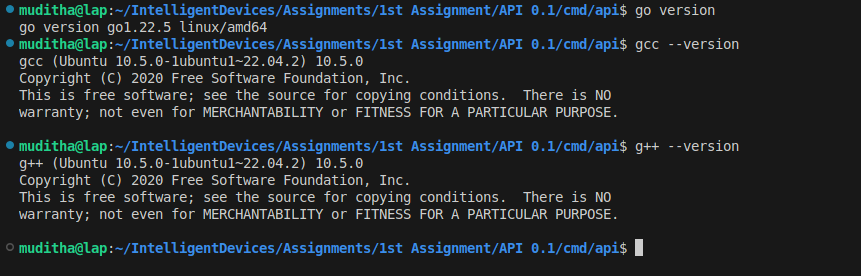
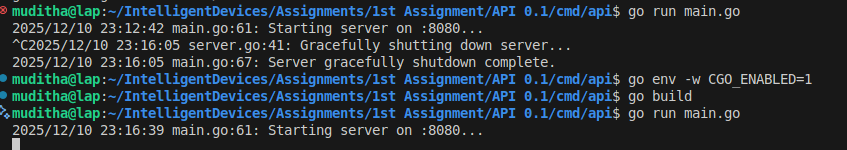
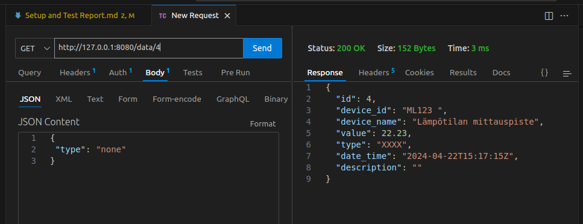
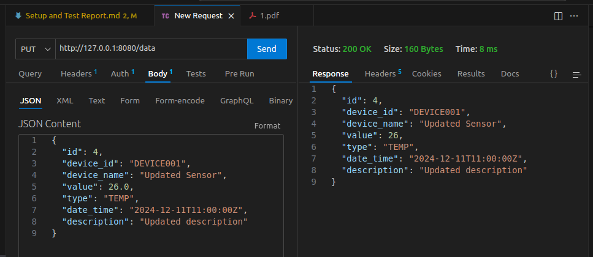
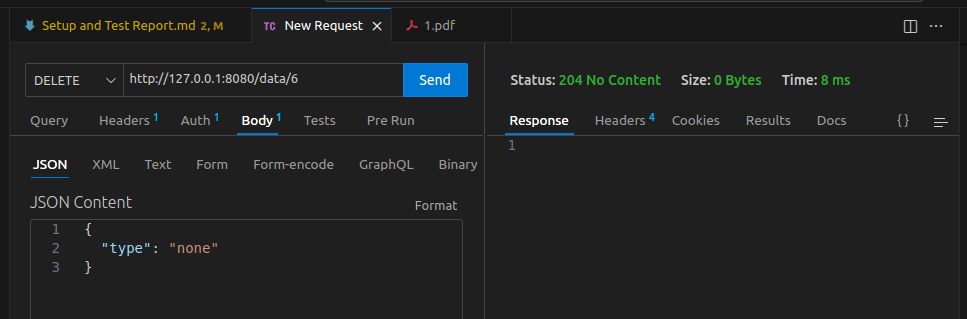

---

# 🎯 Assignment 1: Setup and Test Report

---


## 📝 Introduction

This report documents the setup process and testing results for **Assignment 1** of the Intelligent Devices course. The goal is to ensure the environment is correctly configured and the API is functioning as expected.


## ⚙️ Environment Setup

| Item                | Details                                                      |
|---------------------|--------------------------------------------------------------|
| **Operating System**| Linux                                                        |
| **Programming Lang**| Go                                                           |
| **Git Repo**        | [https://github.com/Muditha-Kumara/Go/tree/main](https://github.com/Muditha-Kumara/Go/tree/main) |
| **Commit**          | `bf39632`                                                    |

**Project Structure:**

```
API 0.1/
  cmd/api/main.go
  internal/api/handlers/
  internal/api/middleware/
  internal/api/repository/
  internal/api/server/
  internal/api/service/
```

---

### 🛠️ Setup Steps

1. Cloned the repository from the provided source.
2. Installed Go, mingw32-base, mingw32-gcc-g++ packages and verified the version.
3. Navigated to the project directory and ran `go mod tidy` to install dependencies.





## 🚀 Running the API

1. Navigated to `API 0.1/cmd/api/`.
2. Ran the API server using:

   ```bash
   go run main.go
   ```

3. Confirmed the server started successfully and was accessible at the expected endpoint.





## 🧪 Testing

API tested using Thunder Client:









## ⚠️ Issues Encountered

- No major issues encountered during setup or testing.


## ✅ Conclusion

The environment was set up successfully, and all tests passed. The API is ready for further development and integration.

---

