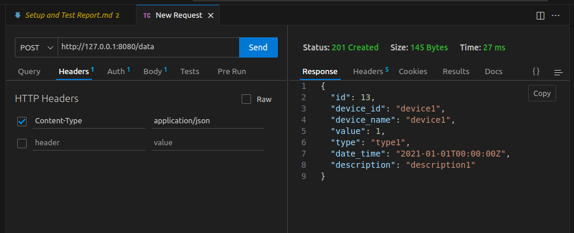
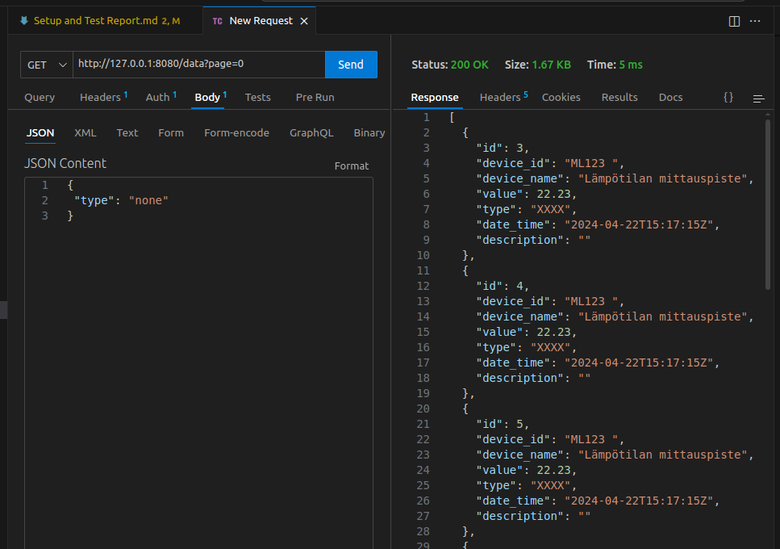

# Assignment 1: Setup and Test Report

## 1. Introduction

This report documents the setup process and testing results for Assignment 1. The goal is to ensure the environment is correctly configured and the API is functioning as expected.

## 2. Environment Setup

- **Operating System:** Linux
- **Programming Language:** Go
- **Project Structure:**
	- `API 0.1/`
	- `cmd/api/main.go`
	- `internal/api/handlers/`
	- `internal/api/middleware/`
	- `internal/api/repository/`
	- `internal/api/server/`
	- `internal/api/service/`

### Steps:

1. Cloned the repository from the provided source.
2. Installed Go, mingw32-base, mingw32-gcc-g++ packages and verified the version.
3. Navigated to the project directory and ran `go mod tidy` to install dependencies.


## 3. Running the API

- Navigated to `API 0.1/cmd/api/`.
- Ran the API server using:

	```bash
	go run main.go
	```

- Confirmed the server started successfully and was accessible at the expected endpoint.


## 4. Testing

- API Test with Thunder Client






## 5. Issues Encountered

- No major issues encountered during setup or testing.

## 6. Conclusion

The environment was set up successfully, and all tests passed. The API is ready for further development and integration.

