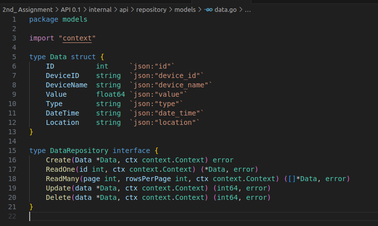
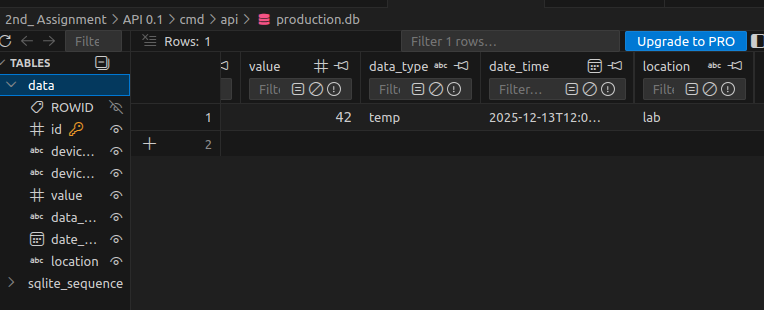
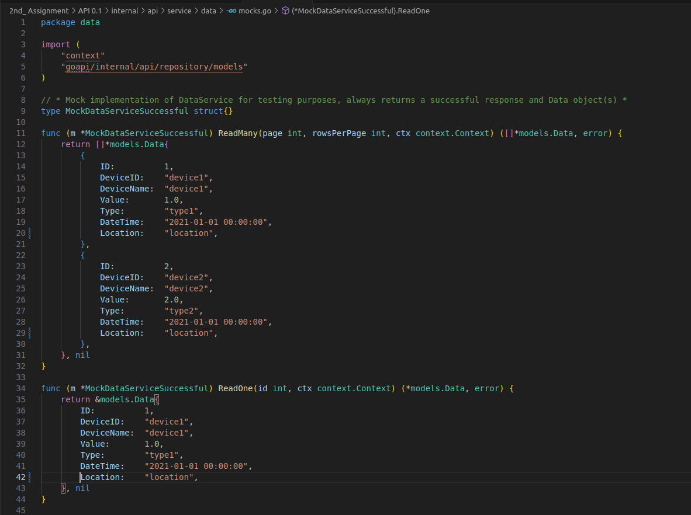
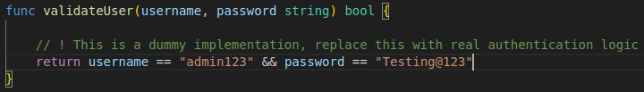
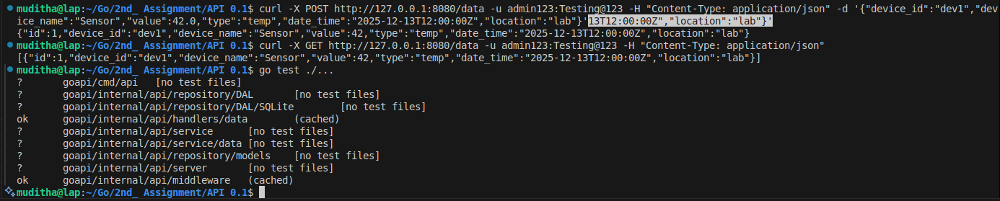

---


# 🎯 Assignment 2: Customizing the Go API Codebase

## ⚙️ Environment Setup

| Item                | Details                                                      |
|---------------------|--------------------------------------------------------------|
| **Operating System**| Linux                                                        |
| **Programming Lang**| Go                                                           |
| **Git Repo**        | [https://github.com/Muditha-Kumara/Go/tree/main](https://github.com/Muditha-Kumara/Go/tree/main) |
| **Commit**          | `xxxxxx`                                                    |

**Project Structure:**

```
API 0.1/
    cmd/api/main.go
    internal/api/handlers/
    internal/api/middleware/
    internal/api/repository/
    internal/api/server/
    internal/api/service/
```

---

---


## 📝 Introduction

This report documents the process of customizing the provided Go backend codebase as per the assignment requirements. The main objectives were to modify the Data entity, update the database schema, adjust handlers, services, validators, authentication, and ensure all changes are tested and documented.


## 1. Codebase Exploration

The project follows a clear Handler-Service-Repository-Model pattern:

- **Handler Layer:** Handles HTTP requests and responses (`internal/api/handlers/data/`).
- **Service Layer:** Contains business logic and validation (`internal/api/service/data/`).
- **Repository Layer:** Manages database access and queries (`internal/api/repository/DAL/SQLite/`).
- **Model Layer:** Defines data structures (`internal/api/repository/models/`).

The flow starts from `main.go`, which initializes the server, sets up middleware, and routes requests through the above layers.

---

## 2. Modifying the Data Entity

**Original Data Entity:**
```go
type Data struct {
    ID          int
    DeviceID    string
    DeviceName  string
    Value       float64
    Type        string
    DateTime    string
    Description string
}
```

**Testing Modification:**  
Suppose I add a new field `Location string` and remove `Description`.


---

## 3. Updating the Database Table

- The SQLite table schema was updated to match the new Data entity.
- The `production.db` file was deleted to allow the application to auto-generate a new schema on startup.

**SQL Table Changed:**
```sql
CREATE TABLE IF NOT EXISTS data (
    id INTEGER PRIMARY KEY AUTOINCREMENT,
    device_id VARCHAR(50) NOT NULL,
    device_name VARCHAR(50),
    value FLOAT,
    data_type VARCHAR(20),
    date_time TIMESTAMP,
    location VARCHAR(100)
);
```



---

## 4. Customizing Handlers

- All handlers in `internal/api/handlers/data/` were updated to parse and return the new Data structure.
- Request and response payloads were adjusted to include/exclude the modified fields.


---

## 5. Adjusting Services and Validators

- The service layer's validation logic was updated to check the new/removed fields.
- Any business rules related to the new entity were implemented.

---




## 6. Authentication Update

- The authentication method uses a static username and password, which are set in the authentication middleware (`internal/api/middleware/basic_authentication.go`).
- The username and password were changed from the default values to new credentials as required by the assignment.



---

## 7. Testing

- All unit tests were updated to reflect the new Data entity and logic.
- Tests were run using `go test` to ensure correctness.
- The API was tested with the new entity and credentials using Thunder Client/Postman.



---

## ✅ Conclusion

All assignment requirements were met:
- The Data entity and all related layers were successfully customized.
- The database schema was updated.
- Handlers, services, and validators were adjusted.
- Authentication was changed.
- All changes were tested and verified.

---


