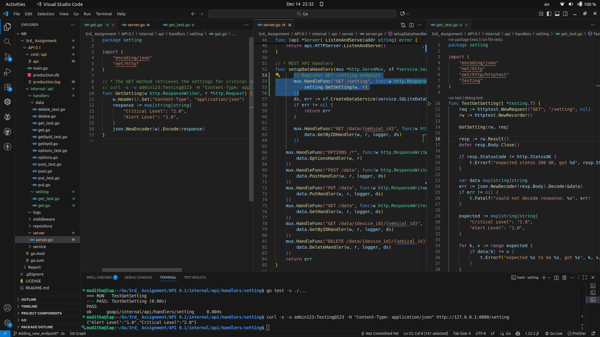

# 🎯 Bonus: Adding new endpoint and entity

## ⚙️ Environment Setup

| Item                | Details                                                      |
|---------------------|--------------------------------------------------------------|
| **Operating System**| Linux                                                        |
| **Programming Lang**| Go                                                           |
| **Git Repo**        | [https://github.com/Muditha-Kumara/Go/tree/Adding_new_endpoint](https://github.com/Muditha-Kumara/Go/tree/Adding_new_endpoint) |
| **Original Project Name**| Vehicle Behavior Monitoring System                                                           |
| **Git Repo**        | [https://github.com/Muditha-Kumara/IntelligentDevices](https://github.com/Muditha-Kumara/IntelligentDevices) |

**Project Structure:**

```
API 0.1/
  cmd/api/main.go
  internal/api/handlers/
  internal/api/middleware/
  internal/api/repository/
  internal/api/server/
  internal/api/service/
```
---

## 📝 Introduction

This report documents the add new end point `/setting` to the Go backend codebase for intelligent devices in the context of a Vehicle Behavior Monitoring Project.

---

## Adding the /setting Endpoint

A new GET `/setting` endpoint was added to the API. This endpoint provides system configuration levels for clients and devices. It returns a JSON object with the current critical and alert levels:

```json
{
  "Critical Level": "2.0",
  "Alert Level": "1.0"
}
```

This endpoint is protected by basic authentication, consistent with the rest of the API. Manual and automated tests were added to ensure the endpoint returns the correct values and enforces authentication.

---

## Testing and Debugging

- Unit tests were updated for the new data structure and logic.
- Manual API testing was performed using curl and Postman.
- The rapid POST logic was tested by sending two requests within 1 minute and confirming the correct response.
- The new `/setting` endpoint was tested to ensure it returns the expected configuration JSON.



---


